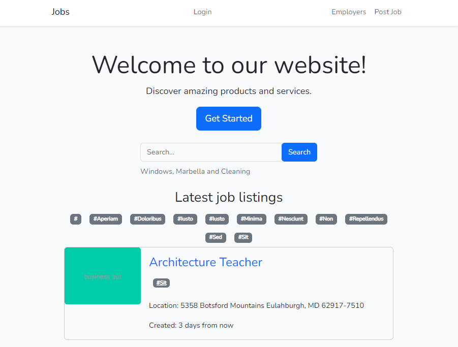

# 🚀 Larajobs

The code represents a list of features for a project. These features include individual SEO-friendly listing pages, payment processing through Stripe 💳, user account authentication 🔐, a simple, mobile-friendly layout with Bootstrap, and the use of Laravel 10 and PHP 8.

## 💻 Installation

1. Clone the repository: `git clone https://github.com/joehunterdev/larajobs`
2. Install the dependencies: `npm install`
3. Configure the environment variables: `.env`
4. Set up the database: `php artisan:migrate --seed`
5. Start the application: `npm run dev`

## 🎯 Usage

1. Open your browser and navigate around [http://localhost:8080](http://localhost:8080)
2. Post a job
3. View your listings
4. See your clicks in dashboard

## 📝 License

This project is licensed under the [MIT License](LICENSE).